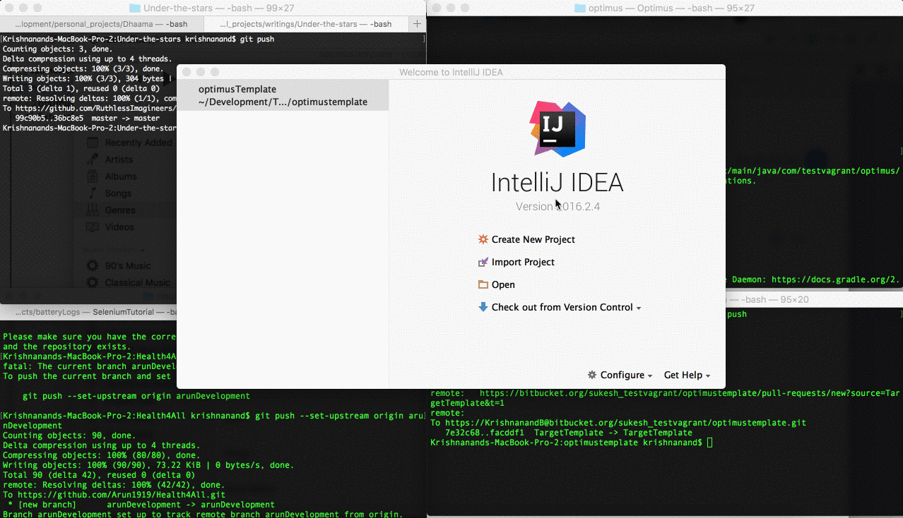

#<span style="color:#B45F04">Optimus Template</span>
Optimus Template is the native framework for Optimus, designed to help you
to get started with your tests in the swiftest time possible.

####<span style="color:#B45F04">First things first</span>
Before you get your hands on Optimus Template, please make sure your system meets the desired
[prerequisites](Prerequisites.md)

##<span style="color:#B45F04">Features</span>
Now that you have reached till here, we assume that your system is ready to host Optimus successfully. Before we jump straight into writing your first test with Optimus Template, let us understand the prowess of Optimus.
With Optimus, you will be able to write tests capable of running in below modes without ever having to worry about managing servers or device setup.

    * Distributed Mode
    * Parallel Mode

If this might sound obvious like any other framework, with Optimus you will be able to test

    * Single App
    * Inter App
    * Mobile Web

##<span style="color:#B45F04"> Test Feed</span>
Optimus is extremely powerful yet fun to work with
once you understand what to feed your tests, for a seamless automation experience.
Test Feed, typically a JSON format, will let you control all your tests from a single source of truth,
giving you complete control of your tests execution. Any Test Feed will contain following sections

    * Common Attributes
    * Appium Server Capabilities
    * Android Only Capabilities
    * Device State

#### <span style="color:#B45F04">Common Attributes</span>
These attributes are set across all tests running on a common test feed.

   <pre>
        <b>Belongs To</b>: Assigns the test to a particular application.
        <b>Runs On</b>: Assigns the test to user specific device. You can choose to run your tests either on device or emulator.
        <b>Application Directory</b>: Specifies the folder name where the application under test is placed.
       </pre>

#####<span style="color:#B45F04">Example</span>


#### <span style="color:#B45F04">Appium Server Capabilities </span>
Optimus by default supports all the capabilities that Appium provides, which you can refer from [here](https://github.com/appium/appium/blob/master/docs/en/writing-running-appium/caps.md).
Since Optimus inherently possesses immense intelligence to handle all capabilities by default without troubling you much,
all it needs are a couple of capabilities.


  <pre>
   <b>App</b>: Name of application to test. Optimus will look for this app under the “appDir” folder specified as part of common attributes.
   <b>Platform Name</b>: Specifies the platform to run the application on.
   </pre>

#####<span style="color:#B45F04">Example </span>


These capabilities will be sufficient enough to run most of the tests if not all.
Under which circumstances you may choose to provide additional
[Appium Server Capabilities](https://github.com/appium/appium/blob/master/docs/en/writing-running-appium/caps.md).

####<span style="color:#B45F04"> Android only Capabilities </span>
Optimus supports all android related capabilities as specified [here](https://github.com/appium/appium/blob/master/docs/en/writing-running-appium/caps.md).
Optimus does not enforce any of these capabilities to be set for running your tests.
However you are free to provide as many capabilities as you may need.

#### <span style="color:#B45F04">Device State</span>
Optimus while being extremely faithful to Appium in terms of capabilities,
it does provide few handy capabilities out of box which resolves many dire issues of mobile automation.

    * Clear Notification
    * Clear ADB logs
    * Grant All Permissions
    * Capture Video

All these capabilities are boolean flags which by themselves are self-descriptive.

With a fair idea of Optimus, now you are all set for your first test.

##<span style="color:#B45F04">Getting started with Optimus Template</span>
You can either fork Optimus Template repository or download the bundle from [here](//set link here).

If you have forked Optimus Template, you can clone it onto your machine using

```bash
git clone <Enter git clone link here>
```

Use your favourite IDE for building the project, however we love
IntelliJ though.



###<span style="color:#B45F04">Your First Test</span>
Writing tests in Optimus is no different than the tests you write everyday,
except that it does most of the heavy lifting, helping you to focus entirely on the test, 
thus the philosophy of Optimus

> <span style="color:#9A2EFE">Focus On Functionality</span>
